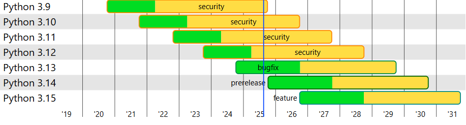

# ANSSI Monitoring Tool

This Python project is a monitoring tool for ANSSI (**REST API**), built using **Python** with **FastAPI** framework, **Jinja2** templates (with **HTML**, **CSS** and **Vanilla JS**) and **MVC** design. It is containerized using **Docker** and managed via **docker-compose**. It aims to track the availability of multiple external APIs.

## Technical Choices

I chose FastAPI because it is simple, modern and efficient for building APIs. It automatically generates interactive documentation (Swagger, ReDoc), which makes development, collaboration and testing easier. FastAPI also provides built-in data validation through Pydantic, reducing boilerplate code and ensuring data consistency. Compared to Flask, it requires less manual setup and compared to Django, it is lighter and more focused on APIs.
Moreover, I chose Jinja2 (which is a Python templating engine) because it lets me render HTML directly from the backend, keeping the stack simple and easy to maintain while React or other frontend frameworks (Angular, Vue, Aurelia) could still be used for more interactive features if needed. 
Using MVC, FastAPI handles the controller, in-memory data structures act as the model and Jinja2 renders the view, keeping logic and presentation separated.

I use Python 3.12 in Visual Studio and Pylint workflow to check clean code requirements.


  
## Prerequisites

Before running this project, ensure you have the following installed:

- [Docker](https://docs.docker.com/get-docker/)
- [Docker Compose](https://docs.docker.com/compose/install/)
- [Git](https://git-scm.com/)

## Clone the repository

To clone the repo on your computer:

```
git clone https://github.com/nicoboga4075/MonitoringTool.git
cd MonitoringTool
```

## Build and Run with Docker

To use the Dockerfile **alone**

- Build the Docker image :

```
docker build -t anssi-monitoring-tool:1.0 .
```
- Run the container :

```
docker run -p 8000:8000 --name my-container anssi-monitoring-tool:1.0
```

## Deploy with Docker Compose

To deploy with Docker Compose upon Dockerfile

```
docker-compose up --build
```
The FastAPI application will be running on http://localhost:8000.

To access the API from a different machine on the network, use the machine's IP address instead of localhost (e.g., http://<your-ip>:8000).

## Project Structure

### API Endpoints

- GET **/api/endpoints** : Fetch all monitored endpoints
- POST **/api/endpoints** : Add a new endpoint to monitor
- DELETE **/api/endpoints/{id}** : Delete an endpoint
- GET **/api/endpoints/{id}/check** : Launch an immediate check of the endpoint
- GET **/api/endpoints/{id}/history** : Fetch the 10 last status

### Accessing the API Documentation

FastAPI provides automatic interactive API documentation. You can access it by visiting the following links in your browser :

- **Swagger UI** : http://localhost:8000/docs
- **Redoc** : http://localhost:8000/redoc

## Possible Improvements

These improvements could make the FastAPI project more robust, efficient and maintainable: enable dynamic management of endpoints from files (CSV or TXT), customizing Uvicorn logs, exporting CSV history, using **SQLAlchemy** for persistent storage, leveraging FastAPI’s native async capabilities and handling session tokens through dependency injection. I could add also **Doctest** in docker-compose file and implement it in the code or use **Robot Framework** to simulate main actions in browser or other Python test frameworks (**Pytest**, **Unittest**). Finally, i could have integrated **Sonar Cloud** or **Codacy** to my project so as to make a deeper audit for my code.

Other improvements:
- Add the date for last 10 status
- Removal confirmation
- Add PUT for edit the endpoint (CRUD)
- Delete duplicates for name
- ...